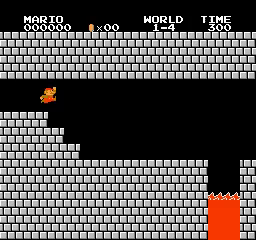
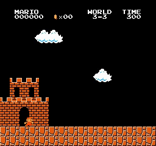
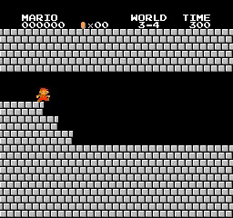
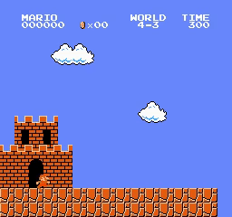
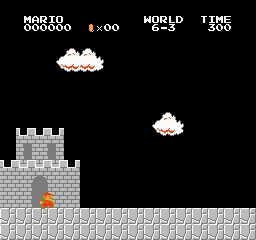

# Mario_PPO_E3B
Playing Super Mario Bros using PPO and State Entropy Maximization with Random Encoders for Efficient Exploration (RE3)

## Introduction

My PyTorch Proximal Policy Optimization (PPO) and Random Encoders for Efficient Exploration (RE3) implement to playing Super Mario Bros. There are [PPO paper](https://arxiv.org/abs/1707.06347) and [RE3 paper](https://arxiv.org/pdf/2102.09430).

  
  
  
   
  
  
  
   
  
  
  
   
  
  
  
   
  
  
  
   
  
  
  
   
  
  
  
   
  
  
  
   
  <i>Results</i>

## Motivation

Recently, I have read and learned about some intrinsic reward methods. I find RE3 to be a very innovative method because it doesn't require training an intrinsic model. I want to implement this algorithm to test it on Super Mario Bros to compare it with other intrinsic reward algorithms like RND, DRND, NGU, NovelD, E3B, ...

## How to use it

You can use my notebook for training and testing agent very easy:
* **Train your model** by running all cell before session test
* **Test your trained model** by running all cell except agent.train(), just pass your model path to agent.load_model(model_path)

Or you can use **train.py** and **test.py** if you don't want to use notebook:
* **Train your model** by running **train.py**: For example training for stage 1-4: python train.py --world 1 --stage 4 --num_envs 8
* **Test your trained model** by running **test.py**: For example testing for stage 1-4: python test.py --world 1 --stage 4 --pretrained_model best_model.pth --num_envs 2

## Trained models

You can find trained model in folder [trained_model](trained_model)

## Hyperparameters

Below is a detailed hyperparameter table for full RE3. This will work for almost stages (except 5-4).

| Hyperparameters | Value |
| :--- | :--- |
| **num_envs** | 32 |
| **learn_step** | 512 |
| **batchsize** | 256 |
| **epoch** | 10 |
| **lambda** | 0.95 |
| **gamma** | 0.99 |
| **gamma_int** | 0.99 |
| **learning_rate** | 7e-5 |
| **target_kl** | 0.05 |
| **clip_param** | 0.2 |
| **max_grad_norm** | 0.5 |
| **norm_adv** | FALSE |
| **V_coef** | 0.5 |
| **entropy_coef** | 0.01 |
| **loss_type** | huber |
| **int_adv_coef** | 0.5 |
| **ext_adv_coef** | 1 |
| **k** | 5 |
| **norm_int_type** | Norm intrinsic reward with RMS or min max scale |
| **embedding_dim** | 150 |
| **average_entropy** | False |
| **capacity** | 1e5 |

### How to find it:
- `num_envs = 32`, the same as previous projects.
- `int_adv_coef, ext_adv_coef: 0.5 and 1`, as in previous projects. set `int_adv_coef <= 0.1` for stage 5-4 (I test `int_adv_coef = 0.1` and `int_adv_coef = 0` as normal PPO). 
- `gamma, gamma_int: 0.99`, like previous projects.
- `entropy_coef = 0.01`: it just work (I don't need to tune this param)
- `learn_step = 512, batchsize = 256, lambda = 0.95, epoch = 10, lr = 7e-5, target_kl = 0.05, clip_param = 0.2, max_grad_norm = 0.5, norm_adv = False, V_coef = 0.5`, as in previous projects.
- `norm_int_type = min_max`: Normalizing intrinsic reward: I tried min-max scaling and dividing by the running standard deviation. RMS did not work at all (it failed at every stage with any tuning of int_adv_coef: `[1, 0.5, 0.1, 0.2, 0.05, 0.01]`). However, min-max scaling worked very well.
- `embedding_dim = 150`: as in paper (paper use 50 or 150 depending on the environment).
- `k = 5`: The selection was random, based on papers and several RE3 projects (the paper used `k = 3` or `k = 50`, but reports showed that values like `[1, 3, 5, 7, or even 9]` did not make much difference). I used `k = 3` when tuning the intrinsic reward with RMS, but it did not work at all. Then I tried `k = 5` (still did not work). After that, I switched to min-max scaling, and it worked. I kept `k = 5` because it worked well, although `k = 3` might still be better, as suggested in the paper.
- `average_entropy = False`: using only the k-th element in KNN or the mean of the k elements in KNN to calculate the intrinsic reward. The paper used two settings: (`average_entropy = False`, `k = 3`) and (`average_entropy = True`, `k = 50`). I tried both settings as well (but using `average_entropy = False`, `k = 5`). I found that using `average_entropy = True` may lead to slower training compared to using `average_entropy = False`, `k = 5` as the default setting. However, both settings successfully completed 1-3, 5-3, and 8-4, with two runs for each setting.
- `capacity = 1e5`: as in paper (paper use 1e4 or 1e5 depending on the environment).
- This Hyperparameters work for almost stages except 5-4. Then I tuning for stage 5-4:
    - run stage 5-4 2nd time (continue fail).
    - k = 3 (fail)
    - k = 50 + average_entropy = True (fail).
    - I observed that the intrinsic reward norm can be very high, averaging > 0.5 and the increases and decreases are fairly consistent (perhaps the policy falls into a certain range and only optimizes local ups and downs during training, I'm not sure). --> reduce int_adv_coef = 0.1 (actually, PPO doesn't need RE3 to complete, so I only need to reduce the influence of int_adv_coef and don't need to observe the intrinsic reward norm).
    - int_adv_coef = 0.1 --> work

## Training step and training time

| World | Stage | training_step | training_time    |
|-------|-------|---------------|------------------|
| 1 | 1 | 94204 | 01:56:05 |
| 1 | 2 | 161778 | 03:23:52 |
| 1 | 3 | 41468 | 00:36:54 |
| 1 | 4 | 13309 | 00:16:22 |
| 2 | 1 | 416748 | 09:36:24 |
| 2 | 2 | 1345013 | 1 days 07:50:04 |
| 2 | 3 | 103925 | 02:32:54 |
| 2 | 4 | 1064416 | 1 days 03:45:30 |
| 3 | 1 | 228351 | 05:30:05 |
| 3 | 2 | 79355 | 02:08:52 |
| 3 | 3 | 28670 | 00:47:30 |
| 3 | 4 | 45565 | 01:14:49 |
| 4 | 1 | 99324 | 02:39:55 |
| 4 | 2 | 2782156 | 2 days 08:27:53 |
| 4 | 3 | 67068 | 01:52:03 |
| 4 | 4 | 48639 | 01:34:59 |
| 5 | 1 | 154103 | 04:16:55 |
| 5 | 2 | 430592 | 12:30:17 |
| 5 | 3 | 1619443 | 23:33:10 |
| `5` | `4` | `86526`  | `1:46:01` |
| 6 | 1 | 44541 | 01:13:43 |
| 6 | 2 | 365042 | 10:04:09 |
| 6 | 3 | 1707002 | 1 days 08:32:09 |
| 6 | 4 | 48638 | 01:18:17 |
| 7 | 1 | 245247 | 07:19:52 |
| 7 | 2 | 2040822 | 1 days 14:32:18 |
| 7 | 3 | 157172 | 04:23:47 |
| 7 | 4 | 183807 | 05:01:41 |
| 8 | 1 | 1079804 | 1 days 05:44:32 |
| 8 | 2 | 892925 | 22:55:50 |
| 8 | 3 | 1035760 | 1 days 02:10:50 |
| 8 | 4 | 1200609 | 21:47:12 |

You can view the reward and intrinsic reward charts during training in the folder [figure](/figure) or in the [figure.md](/figure.md) file.

## Discussion

* About Hyperparameters
    - I'm using this set of hyperparameters based on the ones I'm familiar with from previous projects. This isn't a standard or optimal set of hyperparameters. You can tune them.
    - Some hyperparameters are correlated; if you want to tune one hyperparameter, you need to check the others, for example: learning rate - batchsize, update_proportion - learning rate - batchsize - learn_step, gamma - gamma_int, ...
    - I think k isn't that important because paper reports that k = [1, 3, 5, 7, even 9] are not too different. I also tried 50 and it wasn't too different either (it's unclear whether the training slowed down because of k = 50 or average_entropy; I didn't try that).
    - Except for the method of normalizing intrinsic reward (RMS doesn't work, Paper and some GitHub repositories still use RMS, but I probably wrote the code incorrectly; RMS isn't working!), RE3 is very user-friendly and doesn't require tuning to work (you can choose k arbitrarily, embedding only needs tuning [50, 150] as in the paper, active average_entropy or not). These settings aren't significantly different unless you test thoroughly (maybe run 3-5 times with different seeds for comparison).

* About reward normalization:
    - First, I tried RMS with `int_coef = 0.5`, following other projects, but it did not work.
    - I then tuned `int_coef` with values `[1, 0.5, 0.2, 0.1, 0.05, 0.01]`, but it still did not work.
    - After that, I switched to min-max scaling, and it worked.

* Stage 5-4:
    - This is a very easy stage with most algorithms I've tried (almost always completed very quickly). But I tried tuning a few things and still failed (it seems the intrinsic reward norm is very high > 0.5). And the increases and decreases are fairly consistent (perhaps the policy falls into a certain range and only optimizes local ups and downs during training, I'm not sure).
    - I had to reduce int_adv_coef = 0.1 to reduce the influence of intrinsic reward (it always works because PPO 0 needs intrinsic reward and still completes this stage well).

## Requirements

* **python 3>3.6**
* **gym==0.25.2**
* **gym-super-mario-bros==7.4.0**
* **imageio**
* **imageio-ffmpeg**
* **cv2**
* **pytorch** 
* **numpy**

## Acknowledgements
With my code, I can completed all 32/32 stages of Super Mario Bros.

## Reference
* [rllte RE3](https://github.com/RLE-Foundation/rllte/blob/main/rllte/xplore/reward/re3.py)
* [younggyoseo RE3](https://github.com/younggyoseo/RE3/blob/master/rad_re3/re3.py)
* [CVHvn PPO_RND](https://github.com/CVHvn/Mario_PPO_RND)
* [Stable-baseline3 PPO](https://stable-baselines3.readthedocs.io/en/master/_modules/stable_baselines3/ppo/ppo.html#PPO)
* [lazyprogrammer A2C](https://github.com/lazyprogrammer/machine_learning_examples/tree/master/rl3/a2c)
* [jcwleo RND](https://github.com/jcwleo/random-network-distillation-pytorch/blob/master/utils.py)
* [DI-engine RND](https://opendilab.github.io/DI-engine/12_policies/rnd.html)
* [vwxyzjn cleanrl/ppo_rnd_envpool.py](https://github.com/vwxyzjn/cleanrl/blob/master/cleanrl/ppo_rnd_envpool.py)